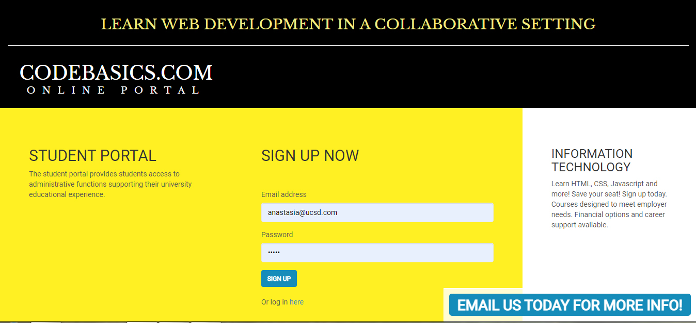
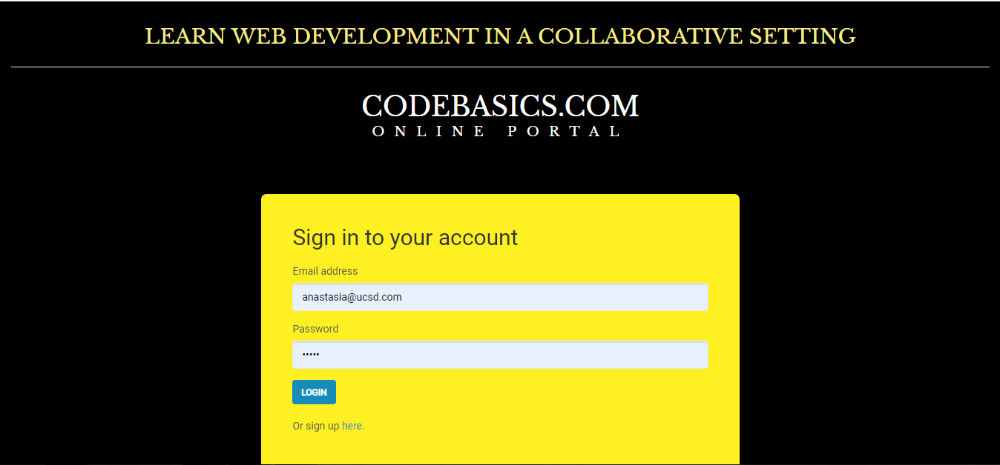
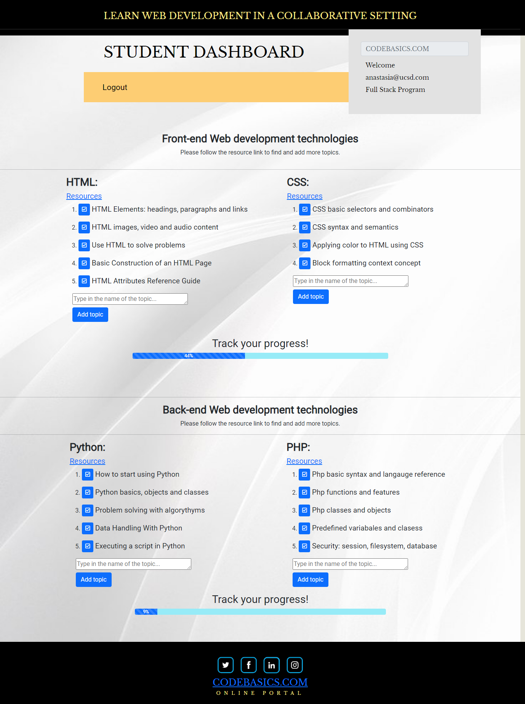
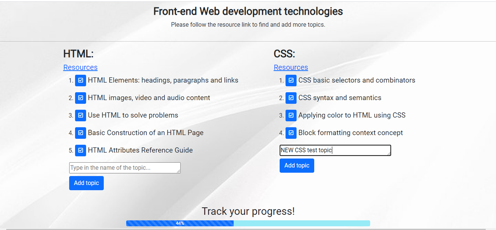
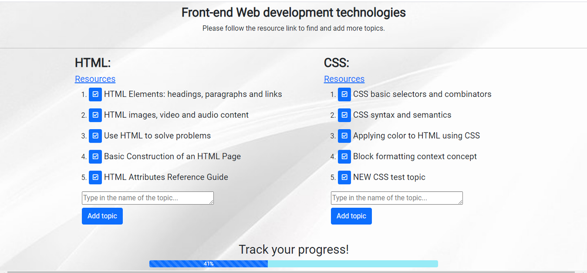
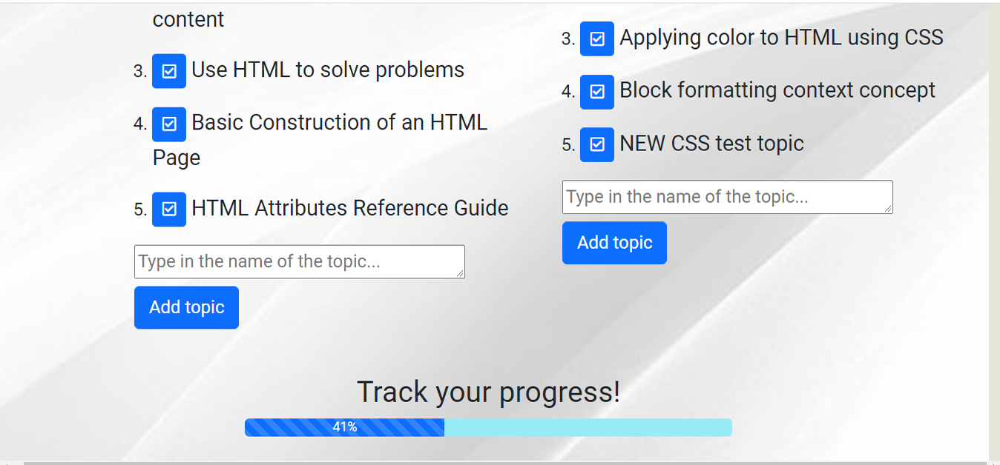
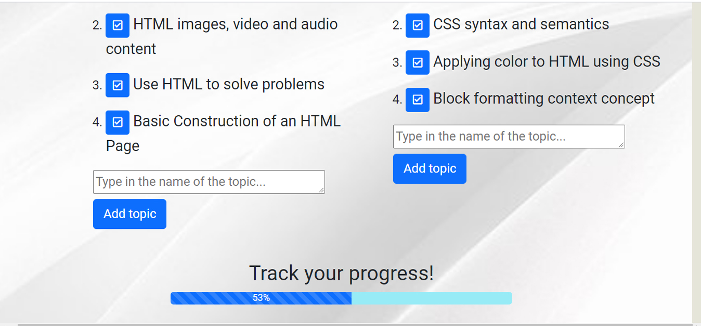
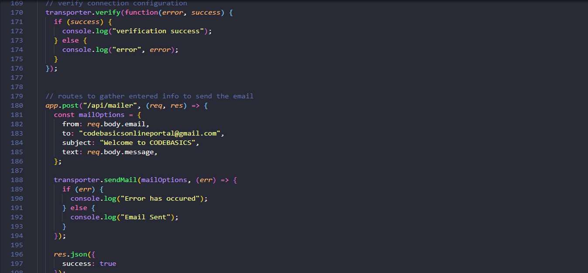
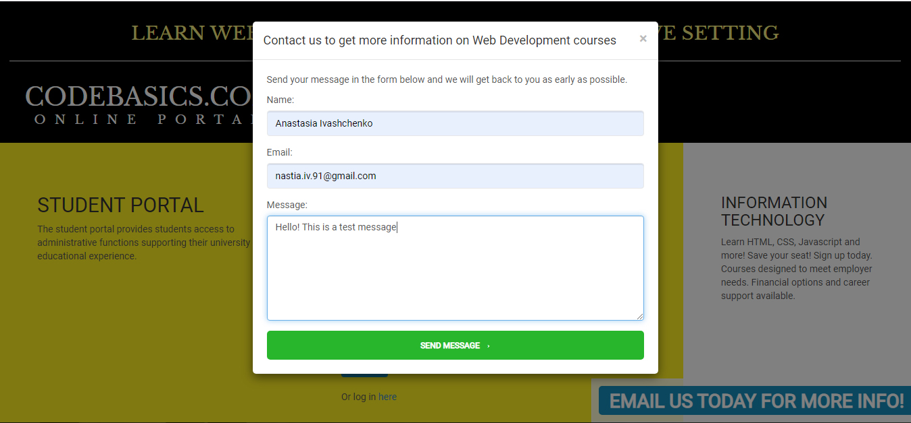

  

# Student Web Development Portal

 ## Table of Contents
  * [Description](#Description)
  * [Installation](#Installation)
  * [Usage](#Usage)
  * [License](#License)

## Description
This application allows students to create an account by signing up with an email and a password and then log into the account to access the information about topics that they want to study that could be marked as "completed" and the percentage of completion will be displayed in the progress bar. The app implements a variety of technologies and programming languages such as JavaScript, jQuery, HTML, CSS, SQL, API requests, Ajax calls, Express.js, Node.js, Passport.js, Sequelize, Nodemailer and Bcrypt. The repository is organized according to MVC framework standards. This full-stack app also introduces simple and intuitive interface.

## Installation
To install this application the user will need to install Node.js and MySQL Workbench, then initialize the folder containing the application by typing `npm init -y` and `npm i` in the command line to install required dependencies such as `dotenv, mysql, sequelize, fs, path, bcrypt, express, passport` mentioned in the `package.json` file that holds various metadata that's relevant to the project. Installing those modules will produce the node_modules folder that is like a cache for the external modules and Nodejs is trained to look for them there. The environmental variables are stored in `.env` file and protected with `dotenv` package.
  
Inside the folder `Config` there is a file `config.json` with a json object containing information about MySQL connection: username, password, name of the database. The name of the database is the same name has to match with the one the user will use in the Workbench, also the  username and password need to be edited to access the data.

## Usage 

The app is depoloyed on Heroku platform. [OPEN Student Web Development Portal](https://vast-shore-72326.herokuapp.com/)
 
After opening the link, the user(a student) will be presented with a sign up page with registration form. The email and password from user's input will be added and saved in the Users table. The password is hushed by Bcript middlewear. 
 

 

 
If the user is a member already, then the link `Log in here` under the sign up form will lead to the login page:
  

 

After logging in, the student will be taken to the members page with student dashboard and 2 sections for Front-end development and Back-end development topics that the class needs to go over. In the header, there's a `Logout` link and on the right there's student's email and the type of course that's being taken. The Front-end development section displays 2 tables with topics for HTML and CSS programming languages. Under each topic's heading there's a Resourses link with the documentation about this particular topic. Underneath, there's a progress bar that's reflecting the success of the class comparing the number of completed topics to the total, and outputs the percentage to the screen.
 

 

 
After choosing a new topic, the student can type it in the empty field under the ordered list and click the button "Add topic"
 

 

 

After that, the topic will appear at the end of the list and also will be saved in the database.
 

 

 

After doing so, the student will notice that the number reflecting the percentage ratio between copmleted/total topic will be automatically updated as well.
 

 

 
Then, after completing certain topics(for example №5 from HTML table and №5 from CSS), the student can click on the blue complete button with a chec kmark. The progress bar will be updated accordingly.
 

 

 

The Back-end development section work the same easy intuitive way. 
 
A new technology - The Nodemailer library was implemented for the students to send their questions straigt to the Codebasics.com official email. Nodemailer is a single module with zero dependencies for Node.js, designed for sending emails. Its main features include: platform-independence, security, Unicode support, HTML content and embedded image attachments, different transport methods besides SMTP support.The user just need to fill up the form with his name, email and  the message. After clicking green button "Send message" the nodemailer function will direct it to the email indicated on line 183 in `api-routes.js` file:
 

 

 
 

 

 

### Contributors

* Larry Gamboa [click here](https://github.com/larrygamboa).
* Anastasia Ivaschenko [click here](https://github.com/anaiva27).
* Ivan Sillas-Navarro [click here](https://github.com/Xicano619).
* Victor Bunduc [click here](https://github.com/victorbunduc).

## License

    Permission is hereby granted, free of charge, to any person obtaining a copy of this software and associated documentation files (the "Software"), to deal in the Software without restriction, including without limitation the rights to use, copy, modify, merge, publish, distribute, sublicense, and/or sell copies of the Software, and to permit persons to whom the Software is furnished to do so, subject to the following conditions:
    
    The above copyright notice and this permission notice shall be included in all copies or substantial portions of the Software.
    
    THE SOFTWARE IS PROVIDED "AS IS", WITHOUT WARRANTY OF ANY KIND, EXPRESS OR IMPLIED, INCLUDING BUT NOT LIMITED TO THE WARRANTIES OF MERCHANTABILITY, FITNESS FOR A PARTICULAR PURPOSE AND NONINFRINGEMENT. IN NO EVENT SHALL THE AUTHORS OR COPYRIGHT HOLDERS BE LIABLE FOR ANY CLAIM, DAMAGES OR OTHER LIABILITY, WHETHER IN AN ACTION OF CONTRACT, TORT OR OTHERWISE, ARISING FROM, OUT OF OR IN CONNECTION WITH THE SOFTWARE OR THE USE OR OTHER DEALINGS IN THE SOFTWARE.
    
